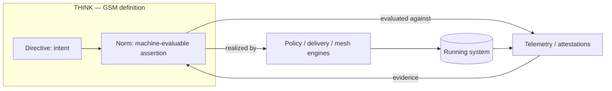

# GSM Cloud-Native Use Cases
{: .no_toc }

**Why a definition/governance standard belongs in the cloud-native ecosystem**
{: .fs-5 .fw-300 }

Cloud-native systems are **governed** systems. Every production workload carries obligations — security posture, reliability targets, supply-chain provenance, data-protection rules, cost ceilings, architectural guardrails. Today those obligations live in wikis, ticket templates, and per-tool config that cannot interoperate. GSM standardizes the **THINK** layer that defines them, exactly as OpenTelemetry standardized the **RUN** layer that observes them.

This page gives concrete, cloud-native use cases. In each, GSM holds the **definition** (the obligation, typed and versioned), while existing cloud-native projects **realize** it (enforce) and **observe** it (supply evidence). GSM does not replace those projects — it gives them a shared, portable source of truth.

## Table of contents
{: .no_toc .text-delta }

1. TOC
{:toc}

---

## The pattern: define once, enforce and observe everywhere



A GSM **Directive** opens the governance intent; a **Norm** makes it measurable; the **Ascription lifecycle** versions and audits it. Enforcement engines and observability pipelines become the effectors and receptors of one closed loop.

## 1. SLO governance, closed-loop with OpenTelemetry

**Problem.** SLOs are agreed in docs, implemented ad hoc in dashboards, and drift from the telemetry that should prove them.

**GSM.** Express the SLO as a Norm; let OpenTelemetry supply the descriptive evidence.

```text
Directive:  platform-team  MUST ENSURE  LatencyProperties  ON  checkout-service
Norm:       checkout-service ON LatencyProperties:
              WHEN  exposure == "public"
              ASSERT  p95_latency_ms < 300
              (SUSTAINED, window=P30D, aggregation=P95, sustainedThreshold=0.99)
```

**Composes with.** OpenTelemetry (metrics/traces as evidence), Prometheus, the SLO tooling ecosystem.

**Payoff.** The SLO is a versioned, portable definition with an auditable lifecycle — not a dashboard annotation. THINK (the obligation) and RUN (the measurement) reference the same object.

## 2. Admission & policy governance (define obligations, let policy engines enforce)

**Problem.** Policy-as-code rules proliferate per cluster and per tool; the *intent* behind them is undocumented and non-portable.

**GSM.** The Directive/Norm is the authoritative obligation; a policy engine is one enforcement effector that compiles from it.

```text
Directive:  security-team  MUST ENSURE  NetworkExposurePosture  ON  internet-facing-workloads
Norm:       internet-facing-workloads ON NetworkExposurePosture:
              ASSERT  hostNetwork == false && default_deny_network_policy == true
              (INSTANTANEOUS)
```

**Composes with.** Open Policy Agent / Gatekeeper, Kyverno (enforcement); Kubernetes admission control.

**Payoff.** One governed definition; many enforcement points. Auditors read the Norm, not a thousand Rego/Kyverno files; engines stay as the realization layer.

## 3. Software supply-chain security

**Problem.** Provenance, signing, and SBOM obligations are scattered across CI config and exception spreadsheets.

**GSM.** Govern the supply-chain obligation as DNA over provenance Archetypes.

```text
Directive:  release-engineering  MUST PREVENT  UnsignedArtifacts  ON  production-images
Norm:       production-images ON ProvenanceProperties:
              ASSERT  slsa_level >= 3 && signature_verified == true && sbom_present == true
              (INSTANTANEOUS)
```

**Composes with.** sigstore (cosign/Rekor/Fulcio), SLSA, in-toto, TUF, SBOM scanners — as signing and attestation evidence.

**Payoff.** "Every production image must meet SLSA L3 and be signed" becomes a single governed, versioned rule with continuous evidence, instead of CI tribal knowledge.

## 4. Zero-trust & service-mesh posture

**Problem.** Service-to-service trust rules are mesh-specific and hard to reason about across clusters.

**GSM.** Model the service coupling as an **Interaction** and govern it with Norms (GSM deliberately replaces "channels" with Interactions + Norms).

```text
Directive:  security-team  MUST ENSURE  mTLSPosture  ON  payment-api
Norm:       payment-api ON mTLSPosture:
              WHEN  caller_boundary == "cross-trust-zone"
              ASSERT  mtls == "STRICT" && spiffe_id_verified == true
              (INSTANTANEOUS)
```

**Composes with.** SPIFFE/SPIRE (workload identity as evidence), Istio / Linkerd (enforcement).

**Payoff.** Zero-trust intent is expressed once over the causal topology and verified against real workload identities — portable across meshes.

## 5. Progressive delivery & GitOps guardrails

**Problem.** "Always canary-analyze before promotion" is a convention enforced unevenly per pipeline.

**GSM.** Govern the *definition* of the rollout obligation; GitOps controllers realize it.

```text
Directive:  platform-team  MUST ENSURE  SafeRolloutProperties  ON  tier-1-services
Norm:       tier-1-services ON SafeRolloutProperties:
              ASSERT  canary_analysis_required == true && auto_rollback_on_slo_breach == true
              (INSTANTANEOUS)
```

**Composes with.** Argo CD / Argo Rollouts, Flux / Flagger (realization); the SLO Norms of §1 as the breach signal.

**Payoff.** Delivery guardrails are a governed standard across every pipeline, with a lifecycle and audit trail.

## 6. Continuous compliance & data protection

**Problem.** GDPR/NIS2/DORA/PCI obligations are tracked in spreadsheets, disconnected from the workloads they constrain.

**GSM.** Source the regulation into Archetypes and Norms; use the `$gsm:dataProtection` vocabulary to govern at-rest/in-transit handling on typed fields.

```text
Directive:  data-governance  MUST ENSURE  DataProtectionProperties  ON  customer-data-services
Norm:       customer-data-services ON DataProtectionProperties:
              WHEN  data_class == "PII"
              ASSERT  at_rest == "encryption" && in_transit == "encryption" && residency in ["eu"]
              (INSTANTANEOUS)
```

**Composes with.** Falco / runtime security (evidence), policy engines (enforcement), TAG Security & Compliance practices.

**Payoff.** Continuous, audit-ready compliance: the obligation, its scope, and its evidence are one governed object — not an annual spreadsheet reconstruction.

## 7. Platform golden paths & FinOps guardrails

**Problem.** Internal developer platforms encode "golden path" and cost rules implicitly; teams discover them by failing CI.

**GSM.** Make the platform's obligations explicit definitions over application Structures, including cost.

```text
Directive:  platform-team  MUST ENABLE  ObservabilityCapabilities  ON  platform-tenants
Directive:  finops         SHOULD MONITOR CostProperties           ON  platform-tenants
Norm:       platform-tenants ON CostProperties:
              ASSERT  monthly_spend_usd <= budget_usd
              (AGGREGATED, window=P30D, aggregation=SUM)
```

**Composes with.** Backstage, Crossplane, KCL/CUE (golden-path realization); OpenCost / Kubecost (cost evidence).

**Payoff.** Golden paths and budgets are discoverable, versioned obligations a platform can publish — and that any conforming tool can read.

## Why this belongs in CNCF

Each use case maps GSM onto cloud-native projects and the CNCF Technical Advisory Groups that steward them:

| Use case | Realized / observed by | Relevant CNCF TAG |
|---|---|---|
| SLO governance | OpenTelemetry, Prometheus | App Delivery · Observability |
| Admission & policy | OPA/Gatekeeper, Kyverno | App Delivery · Security & Compliance |
| Supply chain | sigstore, SLSA, in-toto, TUF | Security & Compliance |
| Zero-trust / mesh | SPIFFE/SPIRE, Istio, Linkerd | Security & Compliance · Network |
| Progressive delivery | Argo, Flux, Flagger | App Delivery |
| Continuous compliance | Falco, policy engines | Security & Compliance |
| Platform & FinOps | Backstage, Crossplane, OpenCost | App Delivery |

The throughline: **GSM is the definitional complement to CNCF's runtime standards.** OpenTelemetry gave the RUN layer a vendor-neutral home at CNCF; the THINK layer — the definitions those runtimes enforce and measure against — needs the same neutral home, for the same reason: portability instead of lock-in.

> See also: **[GSM and the Kubernetes Model](gsm-and-kubernetes.md)** (how GSM generalizes the Kubernetes pattern), the [Specification](specification.md) (normative model), the [Primer](primer.md) (intuition), and the [CNCF Sandbox Proposal](cncf-sandbox-proposal.md).
