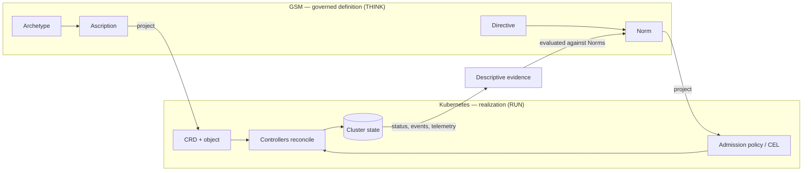

# GSM and the Kubernetes Model
{: .no_toc }

**Kubernetes is a declarative, schema-typed, reconciliation-governed system — a narrow instance of the very pattern GSM generalizes.**
{: .fs-5 .fw-300 }

Kubernetes already proved that infrastructure is best **defined declaratively** and driven toward a desired state by control loops. GSM is that idea, generalized: the same declarative-and-governed pattern, lifted off containers and onto *any* governed subject, with an explicit governance grammar and lifecycle that Kubernetes does not have natively. This page answers a concrete question — *could Kubernetes operate on a GSM-shaped model?* — honestly, with use cases.

## Table of contents
{: .no_toc .text-delta }

1. TOC
{:toc}

---

## The honest scope: govern, don't replace

There are two very different claims, and only one is true.

- **GSM does not replace the Kubernetes control plane.** The scheduler, kubelet, etcd, and the machinery that actually pulls images and runs containers are RUN-layer execution. GSM is a definition/governance model and explicitly scopes runtime/transport *out* (Specification §4.2). GSM is **not** a container orchestrator.
- **GSM can be the definition + governance layer that Kubernetes realizes.** The API object model, its typing, its admission/governance, and its reconciliation semantics map directly onto GSM. In this framing GSM holds the governed *definition*; Kubernetes is a **realization effector** that enforces it and a **status source** that feeds evidence back.

The interesting part: Kubernetes and GSM are **the same pattern at different scopes**. Kubernetes is a declarative system with schema-typed resources (CRDs), control loops (controllers) that reconcile desired vs. observed state, and admission policies. GSM is a declarative system with schema-typed Ascriptions (Archetypes), causal Mechanisms that close the loop between definition and description, and Norms. Kubernetes is, in GSM terms, **a special case specialized to workload orchestration**.

## Concept mapping

| Kubernetes | GSM | Notes |
|---|---|---|
| **CRD / OpenAPI v3 schema** | **Archetype** (JSON Schema 2020-12) | OpenAPI 3.1 aligns with JSON Schema 2020-12 — GSM's exact dialect. A CRD *is* an Archetype. |
| **Resource object** (`spec`) | **Ascription** (`statement`) | A typed instance validated against its schema. |
| **`metadata.name` uniqueness** | `$gsm:unique` | Uniqueness among in-effect instances. |
| **Immutable fields** (admission-enforced) | `$gsm:identityBound` | Values that must not change across versions. |
| **`x-kubernetes-validations` (CEL)** | **Norm `assertion`** (CEL) | Both are machine-evaluable CEL constraints. |
| **`ValidatingAdmissionPolicy` (CEL)** | **Norm** under a **Directive** | GSM scopes the policy to a governed Structure and versions it. |
| **Controller / reconcile loop** | **Mechanism** (rule + ports) | Watched types = Receptors; managed types = Effectors. |
| **`ownerReferences` / GC / finalizers** | **Cascades** (constitutive / governing / dependent) | GSM types the coupling (block vs. no-op vs. degrade). |
| **`spec` vs `status` reconciliation** | **Definition vs. Description** closed loop | GSM separates desired (GSM) from observed (telemetry) explicitly. |
| **Labels / selectors** | **Interaction** + qualifier facet | Explicit, governable coupling rather than implicit label match. |
| **RBAC / admission policy set** | **DNA** (Directives + Norms) | One traceable governance grammar. |
| _(no native equivalent)_ | **Ascription lifecycle** (DRAFT→PROPOSED→APPROVED→ACTIVE→DEPRECATED) | Governed, auditable change with approval gates. |

## A concrete correspondence: schema + CEL

A GSM Archetype with an identity-bound field and a Norm:

```text
Archetype "PaymentService" (JSON Schema 2020-12):
  properties.tier:        { type: string, $gsm:identityBound: true }
  properties.exposure:    { type: string, enum: [internal, public] }

Directive:  security-team MUST ENSURE mTLSPosture ON payment-service
Norm:       payment-service ON mTLSPosture:
              WHEN exposure == "public"
              ASSERT mtls == "STRICT"        # CEL
```

The same intent, projected onto Kubernetes:

```yaml
# CRD field (immutable + CEL validation) and a CEL admission policy
spec.versions[].schema.openAPIV3Schema.properties.tier:
  type: string
  x-kubernetes-validations:
    - rule: "self == oldSelf"          # immutability  ≈ $gsm:identityBound
# ValidatingAdmissionPolicy
spec.validations:
  - expression: 'object.spec.exposure != "public" || object.spec.mtls == "STRICT"'  # ≈ Norm assertion (CEL)
```

GSM and Kubernetes already speak the **same two languages** — JSON Schema for shape and **CEL** for constraints. GSM adds what Kubernetes leaves to convention: a Directive that *scopes and owns* the constraint, and a lifecycle that *versions and approves* it.

## The definition → realization → evidence loop



## Use cases

### UC-K1 — CRDs generated from Archetypes

**Problem.** CRD schemas, immutability rules, and validations are authored per-team and drift from the governance intent behind them.

**GSM.** The Archetype (JSON Schema 2020-12 + `$gsm:*`) is the single source of truth; project it to a CRD: `$gsm:identityBound` → `self == oldSelf` validation, `$gsm:unique` → name/uniqueness, Norm CEL → `x-kubernetes-validations`.

**Realized by.** Kubernetes CRD machinery.

**Payoff.** One governed type definition, many cluster projections — with versioning and approval the CRD lifecycle lacks.

### UC-K2 — Governed admission

**Problem.** Admission policies (Gatekeeper/Kyverno/`ValidatingAdmissionPolicy`) proliferate with no owner, no scope rationale, and no rollout governance.

**GSM.** A Directive opens the scope (governor → governed Structure, viability dimension); a Norm operationalizes it in CEL; the Ascription lifecycle (`PROPOSED → APPROVED → ACTIVE`) gives the policy a governed, auditable rollout. Project the active Norm to a `ValidatingAdmissionPolicy`.

**Realized by.** OPA/Gatekeeper, Kyverno, in-tree CEL admission.

**Payoff.** Admission rules become governed obligations with lineage, not orphaned YAML.

### UC-K3 — A controller is a Mechanism

**Problem.** The operator ecosystem is an opaque web of controllers; which controller consumes/produces which type, and under what obligation, is undocumented.

**GSM.** Model each controller as a Mechanism: its **watched** types are Receptors, its **managed** types are Effectors, and owner relationships are Interactions. The controller binary remains the executor — its rule can be a **native-notation Ascription** sourced from the controller's code (GSM explicitly allows native-notation Elements).

**Realized by.** `controller-runtime` operators (unchanged).

**Payoff.** The reconciliation topology becomes an explicit, queryable, governable causal graph — you can reason about coverage, conflicts, and trust boundaries across operators.

### UC-K4 — Governed desired-state with approval

**Problem.** `kubectl apply` / GitOps changes a workload's desired state with review bolted on externally and no typed invariants.

**GSM.** Wrap the workload's desired state as an Ascription. Changes move `DRAFT → PROPOSED → APPROVED → ACTIVE`; identity-bound fields cannot drift; the **activation handoff** (new ACTIVE deprecates the prior) models a controlled rollout. Only ACTIVE Ascriptions are projected to the cluster.

**Realized by.** Argo CD / Flux apply the ACTIVE projection.

**Payoff.** Approval, audit, and invariant enforcement become part of the definition, above GitOps.

### UC-K5 — Reconciliation as the THINK↔RUN loop

**Problem.** `spec`-vs-`status` reconciliation is per-resource and invisible to cross-cutting governance.

**GSM.** GSM holds desired definition; cluster `status`, events, and OpenTelemetry signals are the descriptive evidence; a governance Mechanism evaluates Norms against that evidence. Drift surfaces as a governance finding, uniformly, across every governed concern — not just per-object.

**Realized by.** Kubernetes status + OpenTelemetry as evidence.

**Payoff.** Reconciliation generalizes from "one object's spec vs status" to "the platform's definition vs description."

### UC-K6 — Typed cascades instead of single-mode GC

**Problem.** `ownerReferences` give one garbage-collection behavior; finalizers patch the gaps ad hoc.

**GSM.** Express lifecycle coupling with GSM's three cascade types — **constitutive** (blocks on failure), **governing** (no-op), **dependent** (degrades) — so deletion/suspension semantics are explicit and differentiated.

**Realized by.** Kubernetes GC + finalizers as the mechanism.

**Payoff.** Richer, intention-revealing lifecycle coupling than a single owner-ref GC mode.

### UC-K7 — One model for the whole platform

**Problem.** Kubernetes governs *workloads*; the teams that own them, the compliance regime, the budgets, and the architecture live in unrelated tools.

**GSM.** Workloads are one Archetype family among many. The owning team, the compliance obligations, the SLOs, and the architecture are all Structures and DNA in the *same* model. Kubernetes objects are governed alongside everything else.

**Realized by.** Kubernetes for the workload slice; other effectors for the rest.

**Payoff.** "Govern the whole, not the code" — the socio-technical platform under one definitional model, with Kubernetes as one realization domain.

## What GSM deliberately does *not* take from Kubernetes

GSM keeps the **model and governance** and leaves the **execution** to Kubernetes:

- No scheduler, kubelet, or container runtime.
- No claim to replace the battle-tested controller ecosystem or its reconciliation performance.
- No opinion on networking, storage, or node management.

GSM's value is *above* the control plane: a portable, vendor-neutral, governed definition that any executor — Kubernetes today, something else tomorrow — can realize.

## Why this matters for CNCF

This is the deepest answer to "is GSM cloud-native?": **GSM generalizes the pattern Kubernetes pioneered.** Kubernetes gave container workloads a declarative, reconciliation-governed model and a neutral home at CNCF. GSM gives *that same pattern* a governance grammar, a lifecycle, and cross-domain reach — and needs the same neutral home for the same reason: so the definitions Kubernetes and its neighbors enforce are portable, not locked in.

> See also: [Cloud-Native Use Cases](cloud-native-use-cases.md), the [Specification](specification.md) (normative model), and the [Primer](primer.md) (intuition).
