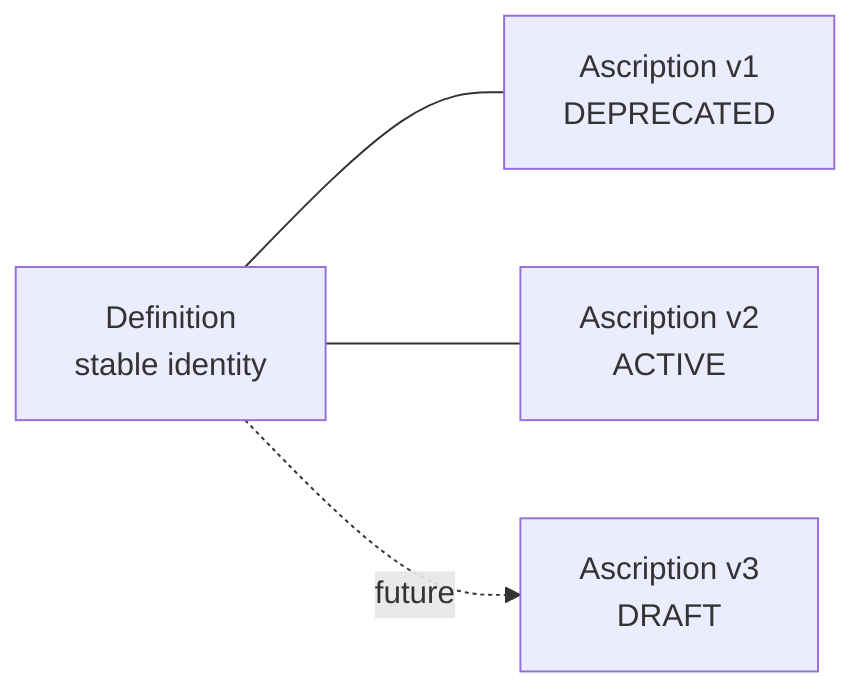
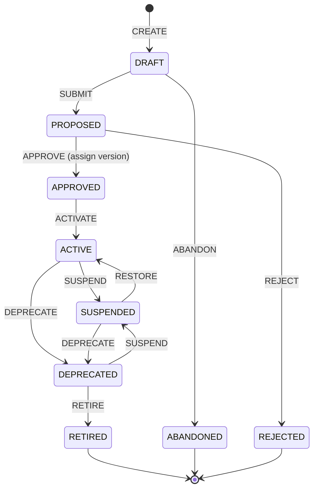

# GSM Primer
{: .no_toc }

**Status:** Non-normative companion to the [Specification](specification.md)
{: .fs-5 .fw-300 }

This primer builds intuition for the Generative System Model. It is **non-normative**: nothing here defines conformance. For the vision and principles, read the **[Manifesto](manifesto.md)**; for the binding rules, read the **[Specification](specification.md)**.

## Table of contents
{: .no_toc .text-delta }

1. TOC
{:toc}

---

## Who should read this

Engineers, architects, and governance practitioners who want to understand *how GSM works* and *why it is shaped this way* before reading the formal specification. No prior systems-theory background is required.

## The one-paragraph version

GSM is a small, fixed vocabulary for writing down **what a system must be** — its purpose, its obligations, its constraints — in a form a machine can check. Instead of governance living in wikis and spreadsheets that drift from reality, GSM expresses it as **typed, versioned definitions** that build pipelines can implement and observability tools can measure against. Eight primitives, one governance grammar, one type system, one lifecycle.

## Define, don't describe

Classical practice *describes* systems after the fact. GSM *defines* them ahead of fact. A description records what a system **is**; a definition declares what a system **must become** and carries the machinery to get there. This reversal — the **Generative Inversion** — is the whole point. A definition is not documentation trailing the system; it is the source the system is built from and measured against.

## Identity vs. snapshot: Definition and Ascription

The first idea to internalize is the split between **identity** and **content**.

- A **Definition** is a stable identity — *the thing being governed*. It never changes. Think of it as a permanent handle: "the payment-service Structure," forever.
- An **Ascription** is a **versioned, governed snapshot** attached to that Definition — *what is currently asserted about it*. Ascriptions come and go; the Definition endures.



At most **one** Ascription is *in effect* (ACTIVE) at a time. When a new version activates, the previous one is automatically retired to DEPRECATED. This is how change stays deliberate and auditable instead of silent.

> **Why the split?** Identity is slow and structural ("what is this?"); content is fast and governed ("what does it currently say?"). Separating them lets the fast layer churn without disturbing the stable referent everything else points at.

## The eight primitives, by example

Imagine an **order-processing** platform that depends on a **payment-service**. GSM models this with eight primitives — and nothing else.

| Primitive | In the example |
|---|---|
| **Structure** | `order-processing` and `payment-service` — each a dynamic aggregate with a `purpose`. |
| **Mechanism** | Inside `payment-service`, a `charge-card` causal unit (its rule logic). |
| **Effector** | `charge-card`'s output port emitting a `PaymentResult`. |
| **Receptor** | `charge-card`'s input port consuming a `ChargeRequest`. |
| **Interaction** | The coupling from order-processing's Effector to payment-service's `ChargeRequest` Receptor. |
| **Archetype** | The `ChargeRequest`, `PaymentResult`, and `SecurityProperties` schemas (the types). |
| **Directive** | "order-processing MUST ENSURE SecurityProperties ON payment-service." |
| **Norm** | "On externally-exposed ports, mTLS must be enabled." |

Two things to notice:

1. **"System" is not in the list.** A Structure *becomes* a system when its own Mechanisms govern itself (they produce Directives/Norms about their owning Structure). Systemness is derived, never stored.
2. **Ports are not authored by hand.** You write the Mechanism's **rule**; the engine reads the rule and derives the Effectors and Receptors from it (§ "Why two languages" below).

## DNA in practice: from Directive to Norm

Governance is written as **DNA** — three layers that change at different speeds:

- **D — Directive (slow, identity).** A *constitutive act* that opens a governance relationship. It names a **governor** (the Structure that issues and is accountable), a **governed** purpose, a **viability dimension** (a qualifier Archetype), a **modal** (obligation strength), and a **verb** (direction).

  > `order-processing` `MUST` `ENSURE` **SecurityProperties** ON `payment-service`

- **N — Norm (medium, constraint).** A *measurable* assertion that operationalizes the Directive within the scope it opened. It carries an **applicability** (when it applies) and an **assertion** (what must hold), both written in a small expression language.

  > `payment-service` ON **SecurityProperties**: WHEN `exposure == "external"` ASSERT `mtls == true`

- **A — Ascription (fast, binding).** The concrete versioned snapshot of any element — the unit that actually moves through the lifecycle.

The chain is always traceable: a Directive opens scope → Norms make it measurable → Ascriptions carry the concrete values. There are **no floating constraints**: every Norm exists because some Directive legitimated it. A Norm with no opening Directive is rejected.

> **Anticipatory governance.** A Directive's `purpose` is a *name*, not a hard reference — so you can govern `payment-service` *before* it exists. Governance intent can precede the structure it demands.

## Archetypes: types that carry meaning

A grammar alone doesn't know what *security* or *latency* means. That meaning lives in **Archetypes** — JSON Schema documents whose `title` is their identity (e.g., `SecurityProperties`). Two distinctions matter:

- **Based vs. rootless.** A *based* Archetype extends exactly one GSM base (e.g., `Structure`) and can **type** an Ascription. A *rootless* Archetype (like a cross-cutting `SecurityProperties` facet) carries no base; it can serve as a **qualifier** (a viability dimension) or a **data** type for ports, but it cannot type a subject.
- **One instance, three roles.** The *same* Archetype instance can simultaneously be a **type** (on an Ascription), a **qualifier** (on a Directive/Norm), and a **data type** (on an Effector/Receptor). One schema, one identity, three relational angles — which is why GSM needs only one Archetype construct.

The whole type system grows from a single **self-typing seed Archetype** (it types itself) — an autopoietic bootstrap. Everything else is validated against it.

## The lifecycle, walked

Every Ascription moves through the same state machine — nine statuses, twelve transitions.



A worked path for the `payment-service` security Norm:

1. **CREATE → DRAFT.** An author writes the Norm.
2. **SUBMIT → PROPOSED.** It goes up for review.
3. **APPROVE → APPROVED.** A version number is assigned (monotonic per Definition). Only one Ascription of a Definition can be APPROVED at a time.
4. **ACTIVATE → ACTIVE.** It is now in effect; any previously ACTIVE version is auto-DEPRECATED.
5. Later, **DEPRECATE → RETIRE** as it is superseded.

Before any transition, every reference the Ascription depends on (e.g., a Norm's governed Structure) must itself be in a compatible state — you cannot ACTIVATE a Norm whose Structure is not at least ACTIVE. These **referee preconditions** keep the governed graph internally consistent.

**Cascades** propagate transitions: a Mechanism and its derived ports rise and fall together (*constitutive*, blocking on failure); a Structure governing its elements is best-effort (*governing*, no-op on failure); ports feeding an Interaction degrade it (*dependent*).

## Why two expression languages

GSM uses two small, sandboxable languages — and no general-purpose DSL.

- **CEL** ([Common Expression Language](https://github.com/google/cel-spec)) for **Norms**. A Norm's `applicability` uses a *restricted* profile (simple axis predicates like `SecurityProperties.exposure == "external"`), and its `assertion` uses a more *permissive* boolean profile. Deterministic, no side effects.
- **Starlark** for **Mechanism rules**. A rule expresses causal logic through a single `sys` namespace:

  ```python
  req = sys.receive("ChargeRequest")
  sys.effect("PaymentResult", charge(req))
  ```

  The engine statically reads this rule and **auto-derives** the ports: `sys.receive("ChargeRequest")` becomes a Receptor; `sys.effect("PaymentResult", …)` becomes an Effector. Because every Archetype name must be a string literal, the derivation is reliable and the sandbox stays analyzable (no `load()`, bounded execution).

Two narrow languages beat one big DSL: each is easy to validate, safe to run, and impossible to misuse for side effects.

## Composing frameworks

GSM is a core to **source into**, not a framework to adopt instead of others. TOGAF, ISO 25010, ISO 25012, GDPR, NIS2, DORA — each maps its concepts onto Directives, Norms, and Archetypes. Because every framework ends up speaking the same DNA, they **compose into one governance fabric** instead of accumulating as disconnected silos. A cross-cutting facet like `SecurityProperties` lets a single Directive + Norm set govern every element that carries that facet — no per-type duplication.

## Where GSM sits next to OpenTelemetry and CloudEvents

GSM governs the **THINK** layer (definition); it does not replace runtime standards.

- **OpenTelemetry** produces the *descriptive evidence* (telemetry) that a Norm is evaluated against. GSM defines the obligation; OTel supplies the measurement.
- **CloudEvents** can carry what an Effector emits: the Effector's data Archetype types the CloudEvent `data` payload.

Definition (GSM) and description (telemetry) are two halves of one loop: define what must be, observe what is, and continuously reconcile the two.

## FAQ

**Is GSM a database or a runtime?** No. It is a *model* and an *interchange format*. The reference implementation (SIE) is one engine that enforces it; conformance is defined so other tools can interoperate.

**Why no "System," "Channel," "Layer," or "Interface" primitive?** Each is either derivable (System, relationships) or expressible with what already exists (Channels → Interactions + Norms; Interface → Effectors/Receptors). Keeping them out keeps the core coherent. See Specification §15.

**Can I extend GSM?** Yes — by defining domain **Archetypes** that extend the bases. You may **not** add new core classes, new `$gsm:*` keywords, or new lifecycle edges. See Specification §16.5.

**How is this different from policy-as-code?** Policy-as-code checks rules against state. GSM governs the **definition of the state itself** — the slow-moving identity and obligations from which both build and run are derived — with a full lifecycle and a governance grammar, not just point-in-time checks.

## How to read the Specification

A suggested order:

1. **§3 Notational conventions** and **§5 Terminology** — the vocabulary.
2. **§6 Core model** — Definition and Ascription.
3. **§7–§8** — the eight primitives and the DNA grammar.
4. **§9–§11** — the Archetype type system and schema vocabulary.
5. **§12** — the lifecycle.
6. **§14** — the expression languages.
7. **§16** — conformance (then the [Conformance](conformance.md) catalog).

Then skim **§17–§20** for ecosystem positioning, security, and versioning.
